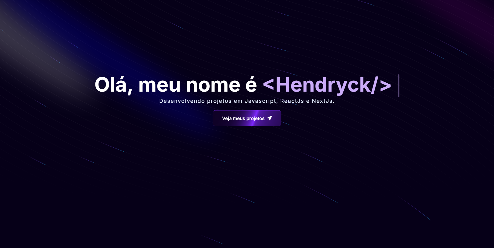

  <h1> 📜 Portfólio Moderno </h1>

 

  

  

  

  
  
  

  

  

 

## 🧑‍💻 Tecnologias

Esse projeto foi desenvolvido com as seguintes tecnologias:

- [ReactJS](https://react.dev)
- [NextJS](https://nextjs.org)
- [TailwindCSS](https://tailwindcss.com)
- [Javascript](https://developer.mozilla.org/pt-BR/docs/Web/JavaScript)
- [Aceternity UI](https://ui.aceternity.com)
- [Figma](http://figma.com/)

## 💻 Projeto

Esse projeto foi construido com o proposito de servir como o meu portfólio pessoal, produzido inteiramente com o meu conhecimento nas tecnologias utilizadas.

## 🌟 Features

- [x] Animações totalmente otimizadas.

- [x] Responsividade.

## 📝 License

Esse projeto está sob a licença MIT. Veja o arquivo [LICENSE](LICENSE.md) para mais detalhes.

---